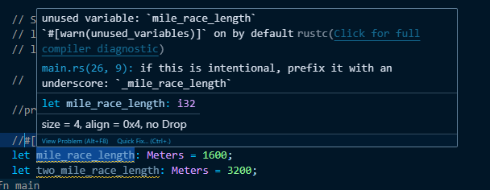
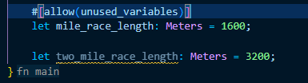
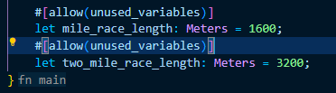

# Intro to Variables 
Trong Rust, khai báo biến bằng từ khóa `let`
```c
let apples = 50;
```
* Rust mặc định biến `apples` là bất biến (immutable variables), không thể thay đổi giá trị được, nghĩa là không thể gán lại giá trị cho biến đó nhưng vẫn có thể sử dụng nó trong các biểu thức 

Khi khai báo biến, ta sẽ thấy `let apples: i32 = 50`, nghĩa là:
* Khi gán một giá trị cho biến, Rust sẽ giả định hoặc suy ra kiểu dữ liệu của biến

# Interpolation with Curly Braces 
Để chèn giá trị biến hoặc biểu thức vào chuỗi khi in ra bằng `println!()` ta sử dụng `{}`
Ví dụ:
```c
println!("This year, my garden has {} apples", apples - 10);
```
>This year, my garden has 40 apples

hoặc
```c
println!("This year, my garden has {apples} apples");
```
>This year, my garden has 50 apples

**Lưu ý:** Khi sử dụng cách ở dưới, ta phải bắt buộc truyền vào `tên biến`
# Positional Arguments to println!()
Rust cho phép tham chiếu đến các đối số theo thứ tự vị trí thay vì sử dụng lần lượt `{}`
Ví dụ:
```c
println!(
        "This year, my garden has {0} apples and {1} oranges",
        apples, oranges
    );
```
>This year, my garden has 50 apples and 20 oranges

* Trong ví dụ trên, `apples` là chỉ số thứ 0, `oranges` là chỉ số thứ 1

**Khi nào nên dùng Positional Arguments?**
* Khi muốn tái sử dụng lại giá trị nhiều lần mà không cần lặp lại trong danh sách đối số
*  Khi bạn muốn đảo thứ tự in ra mà không thay đổi vị trí đối số trong hàm

Ví dụ:
```c
let x = "Rust";
let y = 2025;

println!("Welcome to {0} in the year {1}. Yes, {0} is awesome!", x, y);
```
>Welcome to Rust in the year 2025. Yes, Rust is awesome!

# Underscore with Variables
Trong Rust, nếu khai báo và gán giá trị cho một biến nhưng không sử dụng thì nó sẽ tạo ra 1 warning


Thêm `_` trước tên biến là xong `_fruits` 
# Immutable and Mutable Variables
**Immutable** là biến không thể thay đổi được, **Mutable** là biến có thể thay đổi được
Khi khai báo biến, Rust mặc định đó là biến bất biến (Immutable variable). Sau khi khai báo, nếu thay đổi giá trị của biến, trình biên dịch sẽ báo lỗi


Cho nên, nếu muốn thay đổi giá trị biến, ta phải khai báo đó là biến **Mutable**
```c
let mut apples = 50;
println!("There are {apples} apples");
apples = 40;
```
Sau khi thay đổi giá trị của biến `apples` trong đoạn code, về cơ bản compiler vẫn warning ở dòng `apples = 40;` điều này giúp code sạch hơn, tránh lỗi logic 
# Variable Shadowing
Trong Rust, **Variable Shadowing** là khai báo lại một biến cùng tên trong **cùng một phạm vi (scope)**, khiến biến cũ bị ẩn đi và không còn được truy cập nữa. Việc sử dụng **Shadowing** có thể làm thay đổi kiểu dữ liệu
```c
let grams_of_protein = "100.345";
let grams_of_protein = 100.345;
```
**So sánh với `mut`**
|   |     `mut`    | `shadowing` |
|---|---|---|
|Thay đổi giá trị?  | có |  có  |
|Thay đổi kiểu?     | không |  có  |
|Biến?     | ghi đè biến cũ |  tạo biến mới  |

# Scope
Trong Rust, **scope (phạm vi)** là vùng mà một biến tồn tại và có hiệu lực. Khi phạm vi kết thúc, biến cũng tự động bị hủy (drop) — rất quan trọng trong quản lý bộ nhớ tự động của Rust (ownership)
```c
 let coffee_price = 5.99;

    {
        let cookie_price = 1.99;
        println!("The cookie price is {cookie_price}");
        println!("The coffee price is {coffee_price}");
    }
```
>The cookie price is 1.99
>The coffee price is 5.99

Diễn giải:
* Biến `coffee_price` được khai báo trong hàm `main` nên nó có phạm vi trên toàn hàm `main`
* Biến `cookie_price` được khai báo trong block con `{}` nên chỉ tồn tại trong block đó, nên khi block đó kết thúc `cookie_price` hết phạm vi và drop 

Code lỗi: 
```c
let coffee_price = 5.99;

    {
        let cookie_price = 1.99;
        println!("The cookie price is {cookie_price}");
        println!("The coffee price is {coffee_price}");
    }
    // error
    println!("The cookie price is {cookie_price}");
```
Ngoài ra, còn có trường hợp:
```c
 let coffee_price = 5.99;

    {
        let coffee_price = 1.99;
        println!("The coffee price is {coffee_price}");
    }
    println!("The coffee price is {coffee_price}");
```
Đây không phải là **Shadowing** mà cú pháp này chỉ đang tạo ra một biến `coffee_price` độc lập và riêng biệt trong scope 
Kết quả:
>The coffee price is 1.99
>The coffee price is 5.99
# Constants
**Constants (hằng số)** là những giá trị cố định được xác định một lần và không thể thay đổi

Quy tắc khai báo:
* Phải ghi rõ kiểu dữ liệu: f64, i32, usize,...
* Tên hằng viết hoa + gạch dưới: MAX_SPEED, TAX_RATE,...
* Giá trị phải là biểu thức hằng: phải biết được giá trị của constant tại thời điểm biên dịch (compile-time)
* Khai báo toàn cục hoặc cục bộ đều được
```c
const MAX_SPEED: u32 = 640;

fn main() {
    println!("Max speed: {MAX_SPEED}");
}
```
>Max speed: 640
# Type Aliases
Trong Rust, **type alias** được khai báo bằng từ khóa `type`. Đây là cách đặt tên khác cho một kiểu dữ liệu hiện có, thường dùng để:

* Rút gọn các kiểu dài dòng (như Result<T, MyError>)
* Làm mã dễ đọc hơn
* Dễ tái sử dụng

Ví dụ: 
```c
type Meters = i32;
fn main() {
    let mile_race_length: Meters = 1600;
    let two_mile_race_length: Meters = 3200;
    println!("A mile: {mile_race_length}");
    println!("Two mile: {two_mile_race_length}");
}
```
>A mile: 1600
>Two mile: 3200

# Compiler Directives
Trong Rust, **compiler directives (chỉ thị tiền xử lý)** được bắt đầu bằng attributes `#` dùng để hướng dẫn cho compiler về cách biên dịch mã nguồn. Chúng không tạo ra mã máy mà tác động đến quá trình dịch mã 
`#[allow(...)]` bỏ qua warnings của compiler
Ví dụ:
Code chưa có `allow`


Sau khi `allow`




Ngoài ra, có thể đặt chỉ thị `allow` ngoài hàm `main` để áp dụng cho nguyên hàm (như global) nhưng cú pháp sửa đổi một chút `#![allow(unused_variables)]`

# Quiz
## What keyword declares a variable?
* var
* declare
* const
* let
>let
## A variable is ____ by default?
* mutable
* immutable
>immutable
## What characters interpolate a dynamic value into a string?
* <>
* {}
* :?
* ""
>{}
## Rust counts positions starting from?
* -1
* 0
* 1
* 2
>0
## What keyword declare a variable as mutable?
* none. A variable is mutable by default
* mute
* mut
* mutable
>mut
## What character tells the compiler to ignore an unused variable?
* \#
* !
* ?
* _
> _
## What will be the result of this code?
```c
fn main(){
    let latte = "Latte";
    let cappuccino = "Cappuccino";
    println!("I like {1} and {2}", latte, cappuccino);
}
```
* "i like Latte and Cappuccino"
* "I like Cappuccino and Latte"
* "I like latte and cappuccino"
* The code will not compile
> The code will not compile
## What is the correct syntax for applying a compiler directive to the following line?
* [allow(unused_variables)]
* #[allow(unused_variables)]
* #[!allow(unused_variables)]
* !#[allow(unused_variables)]
* #(allow[unused_variables])
> #[allow(unused_variables)]
## What keyword declares a constant in the program?
* let
* const
* var
* final
> const
## How do I fix the following code?
```c
fn main(){
    let city = "Metropolis";
    city = "Gotham";
}
```
* The code doesn't need a fix. It will compile and run fine
* Add a mut keyword before the let keyword in the variable declaration
* Add a mut keyword after the let keyword in the variable declaration
* Add a mut keyword before the city variable when assigning the new value ("Gotham") to it
> Add a mut keyword after the let keyword in the variable declaration
## What word means "the region of code where a name is valid"?
* Function
* Source code
* Compilation
* Scope
> Scope
## What's wrong with the following code?
```c
fn main(){
    let mut genre = "Romance";
    genre = 52;
}
```
* There is nothing wrong with the code
* The mut keyword is not required
* There shouldn't be a semicolon after the assignment of 52
* The code is trying to assign an integer to a variable expecting a string
> The code is trying to assign an integer to a variable expecting a string
## Which characters create a block?
* Pair of parentheses (())
* Pair of square brackets ([])
* Two forward slashes (//)
* Opening and closing braces ({})
> Opening and closing braces ({})
## What keyword declares an alias/nickname for an existing type?
* redeclare
* type
* alias
* rename
> type
## What will be output when this code runs?
```c
fn main(){
    let city = "Huntington";
    println!("{city}");
    let city = "Plainview";
}
```
* Huntington
* Plainview
* city
* {city}
> Huntington
